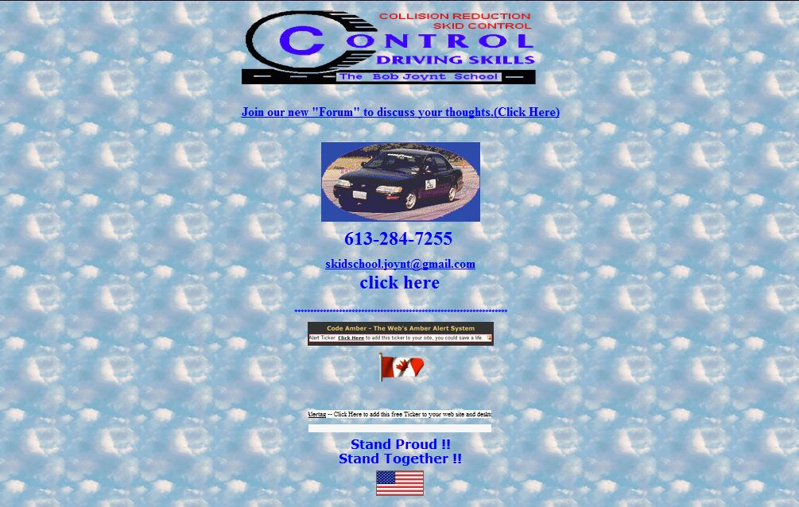

# dev-harry-final
# Order Manager App

## Overview
This app allows users to:
1. Load their last or favorite order.
2. Edit order details using a web-based form.
3. Save the edited order and view the updated JSON in the browser console.

## Features
- Preloaded order data is displayed dynamically.
- Users can edit customer details, item names, and quantities.
- Changes are reflected in the DOM and logged in JSON format.
- Five input types are used:
  - Text (for names and item names)
  - Number (for item quantities)
  - Checkbox (for gift wrap)
  - Tel (for phone number)
  - Datetime-local (for delivery date)

## Screenshot
